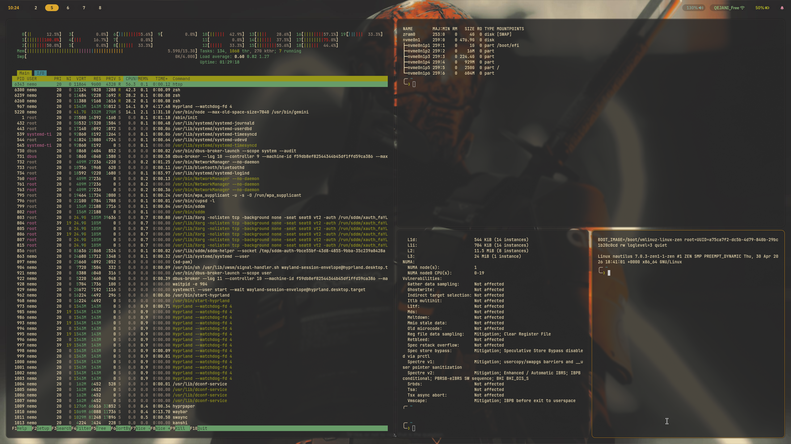
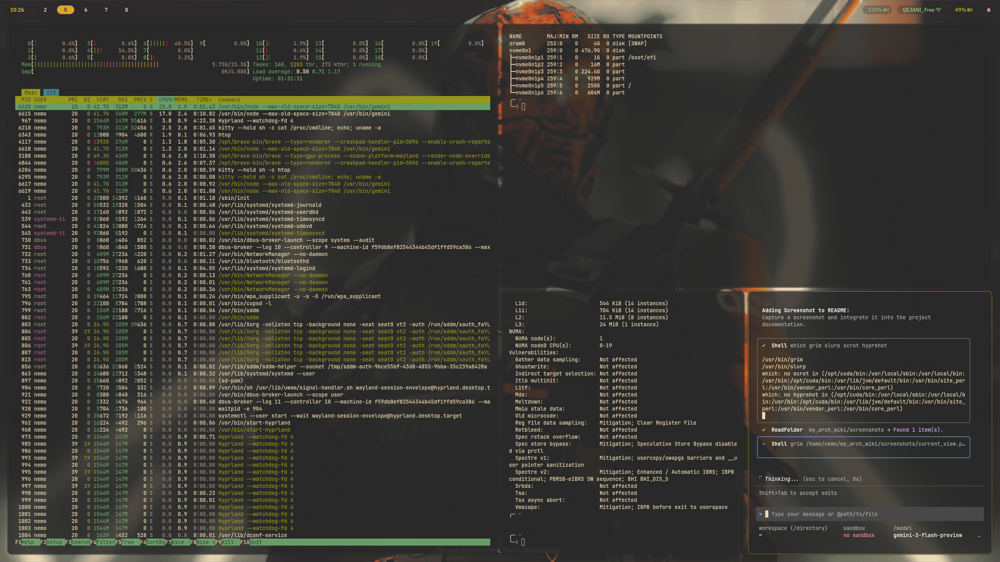

# My Arch Linux Journey 🐧

Welcome to my personal Arch Linux wiki and configuration repository. This project serves as a living document of my experiences, troubleshooting steps, and system configurations.

## 💻 System Profile

### Hardware Specifications
| Component | Specification |
| :--- | :--- |
| **CPU** | 12th Gen Intel® Core™ i7-12700H |
| **GPU** | NVIDIA GeForce RTX 3070 Ti Laptop / Intel Iris Xe |
| **Memory** | 16GB RAM |
| **Storage** | 512GB Micron 2450 NVMe |

### Software Stack
| Category | Selection |
| :--- | :--- |
| **Kernel** | [Linux Zen](https://github.com/zen-kernel/zen-kernel) |
| **WM / Compositor** | [Hyprland](https://hyprland.org/) |
| **Shell** | Zsh + [Oh My Zsh](https://ohmyz.sh/) |
| **Terminal** | [Kitty](https://sw.kovidgoyal.net/kitty/) |
| **File Manager** | [Dolphin](https://apps.kde.org/dolphin/) |

## 📸 Desktop Showcase




## 🎯 The "Why"

Documenting my journey is essential for several reasons:
- **Understanding:** Writing down solutions helps me internalize how the system works.
- **Efficiency:** I no longer need to search for the same solutions repeatedly (e.g., remembering exactly what `nomodeset` does and when to use it).
- **Persistence:** A central place to store my hard-earned workarounds for EFI partitions, GRUB failures, and kernel quirks.
- **Version Control:** Keeping my dotfiles safe and version-controlled for future installations.

## 🛠 Knowledge Base

This section focuses on the technical hurdles I've cleared:

- **Bootloader & Partitions:**
  - Managing **EFI partitions** without the headaches.
  - Troubleshooting **GRUB** when things go sideways.
- **Kernel Parameters:**
  - Quick reference for parameters like `nomodeset` and other boot-time fixes.
- **Window Managers:**
  - Deep dives into **Hyprland** configurations and optimization.

## 📂 Project Structure

```text
.
├── docs/          # Detailed guides and troubleshooting articles
├── dotfiles/      # System and application configuration files
├── scripts/       # Automation and utility scripts
└── README.md      # This file
```

## 🚀 How to Use This

If you find yourself here, feel free to browse the `docs/` directory for specific guides or explore my `dotfiles/` to see how I've customized my environment. 

> **Note:** These configurations are tailored for my specific hardware and workflow. Always review scripts before running them on your own system!

---
*Maintained with ❤️ by a fellow Arch user.*
